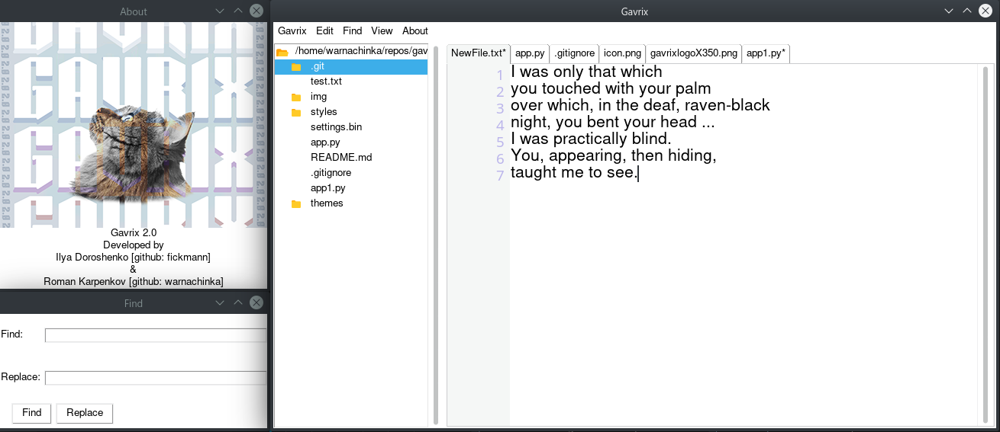

Introduction
============
Gavrix is a full-functional text editor capable of running UTF-8 encoded text files as well as images.
You can run several files at the same time by switching between them using tabs.
Also, 2 color themes are available to the user, which can be edited in the corresponding json file. 

